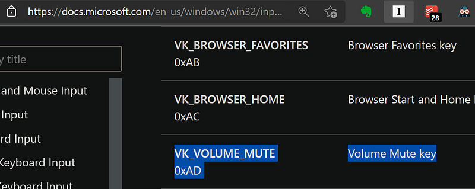

# Using PowerShell to Manage Windows Audio Volume Level

Manage Windows Audio Level with PowerShell - A quick reference guide for controlling the audio level within Windows OS programmatically.


## Overview

This script was created because I needed a way to control the audio level within Windows remotely and programmatically. Windows does not offer a class or module to easily control the audio level directly. Because of that, I decided to use a custom VB Script via [Windows Shell](https://devblogs.microsoft.com/scripting/how-to-use-vbscript-to-run-a-powershell-script/)'s [SendKey](https://learn.microsoft.com/en-us/archive/technet-wiki/5169.vbscript-sendkeys-method) method to send keystrokes to the active window to control the audio level.

### I've Broken Down the Content into Two Sections

1. [How it Works](#how-it-works) - This section explains how the script works and how you can use it to control the audio level within Windows.
2. [Custom Function - `Set-AudioLevel](#custom-function---set-audiolevel)` - This section includes the function I created to control the audio level within Windows. I've included the full function with commentary and a single line declaration for easy CLI usage.

## How it Works

The script uses PowerShell to create a COM object of the type `WScript.Shell`. This object allows you to interact with the Windows Shell and perform various actions, including sending keystrokes to the active window. I'm using the `SendKeys` method from the `WScript.Shell` object to send keystrokes to control the audio level within Windows.

### Got Key Codes for Volume Control

To verify the key codes for volume control, you can use the following steps:

1. Navigate to [Microsoft.com - virtual-key-codes](https://learn.microsoft.com/en-us/windows/win32/inputdev/virtual-key-codes), and search for the Constant you want to execute.
   > For example, `Volume Mute` is `VK_VOLUME_MUTE` which is `0xAD` in Hex.
   > 
2. Navigate to [Unicode Lookup](https://unicodelookup.com/) and search for the HEX value to get the Decimal Representation of the hex code.
   > For example, `0xAD`'s base 10 value is `173­`.
   > 

### Shell Object is Created, and Keystrokes are Sent to Control Volume

1. Volume Mute: `[char]173`

   > ```powershell
   > (new-object -com wscript.shell).SendKeys([char]173)
   > ```

2. Volume Up: `[char]174`

   > ```powershell
   > (new-object -com wscript.shell).SendKeys([char]174)
   > ```

3. Volume Down: `[char]175`

   > ```powershell
   > (new-object -com wscript.shell).SendKeys([char]175)
   > ```

---

## Custom Function - `Set-AudioLevel`

In this section, I've included the function I created and use. I've included the full function with commentary and a single line declaration for easy CLI usage.

### Fully Documented Version

> This is the full function from my notes that I use to control the volume level within Windows. I've included it here with full commentary for easy reference.

```powershell
function Set-AudioLevel {
    <#
    .SYNOPSIS
        Manage Windows Audio Volume Levels With PowerShell.

    .DESCRIPTION
        Using PowerShell to create a COM Object of the type Windows Shell. Then running Windows Shell function function SendKeys() with the parameters `[char]173`, `[char]174`, or `[char]175`.

    .PARAMETER Level
        The desired volume level as a whole number (0-100).

    .EXAMPLE
        # Set Audio Level to a target percentage.
        Set-AudioLevel -Volume 60

        # Mute Audio
        Set-AudioLevel -Volume 0

    .NOTES
        Author:     Erik Plachta
        Created:    11/09/2021
        Updated:    20241127
        Version:    0.0.22
        Changelog:
            - 0.0.1 | 20211109 | Erik Plachta | FEAT: Initial Version
            - 0.0.2 | 20241026 | Erik Plachta | BUG: Fix volume level calculation rounding error.
            - 0.0.21| 20241026 | Erik Plachta | FEAT: Add validation. Add updated logic.
            - 0.0.22| 20241127 | Erik Plachta | CHORE: Cleanup and verify for publication to medium.com and GitHub readme.
    #>
    param(
        [Alias("AudioLevel", "L", "l", "volume", "vol")]    # Allow multiple parameter names
        [Parameter(Mandatory,Position = 1)]                 # Make the parameter mandatory and positional so can be used without specifying the parameter name
        [System.Double]$Level                               # Define the parameter type
    )

    try{

        # 1. Validate input to ensure level is between 0 and 100
        if ($level -lt 0 -or $level -gt 100) {
            Write-Output "Error: Volume level must be between 0 and 100."
            return
        }

        # 2. Create Shell Object
        $wshShell = New-Object -ComObject wscript.shell

        # 3. Set volume to minimum (0%) by sending Volume Down key repeatedly
        1..50 | ForEach-Object {
            $wshShell.SendKeys([char]174)  # [char]174 is Volume Down
            Start-Sleep -Milliseconds 5   # Small delay to ensure each key press registers
        }

        # 4. Calculate the exact number of Volume Up presses needed
        $upPresses = $level / 2.0  # Calculate as a double to avoid rounding

        # 5. Increment to the desired volume level using exact decimal count
        for ($i = 0; $i -lt $upPresses; $i += 1) {  # Increment by 0.5 for more precision
            $wshShell.SendKeys([char]175)  # [char]175 is Volume Up
            Start-Sleep -Milliseconds 5   # Small delay to ensure each key press registers
        }
        Write-Output "SUCCESS: Volume set to approximately $level%."
    }
    catch {
        Write-Output "ERROR: Unable to set volume level."
        Write-Error $_
    }

}
```

### Single Line Declaration

> This is the same function as above converted to a single line for easy CLI usage. Notice at the end it's calling the function `Set-AudioLevel 0` to set the volume to 0%.

```powershell
function Set-AudioLevel {param([Alias("AudioLevel","L","l","volume","vol")][Parameter(Mandatory,Position=1)][System.Double]$Level) {try{$wshShell=New-Object -ComObject wscript.shell;1..50|ForEach-Object{$wshShell.SendKeys([char]174);Start-Sleep -Milliseconds 5};$upPresses=$level/2.0;for($i=0;$i -lt $upPresses;$i+=1){$wshShell.SendKeys([char]175);Start-Sleep -Milliseconds 5};"SUCCESS: Volume set to approximately $level%."}catch{Write-Output "ERROR: Unable to set volume level.";Write-Error $_}}} Set-AudioLevel 0
```

---

## Wrapping Up

If you made it this far, thank you for reading. I hope you found this guide helpful. If you want to collaborate, discuss, or have questions just let me know in comments below or on my GitHub repo: [github.com/Erik Plachta/Powershell-Set-AudioLevel](https://github.com/ErikPlachta/PowerShell-Set-AudioLevel).
